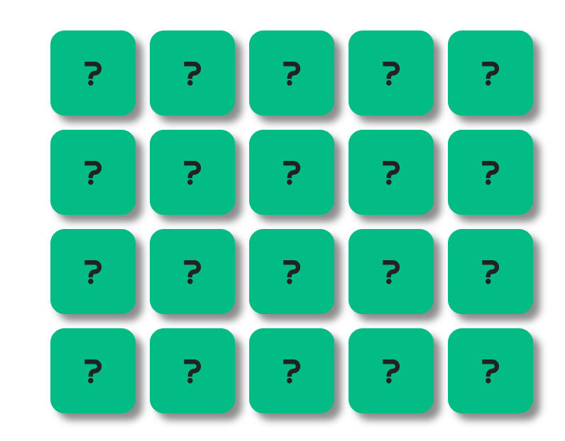
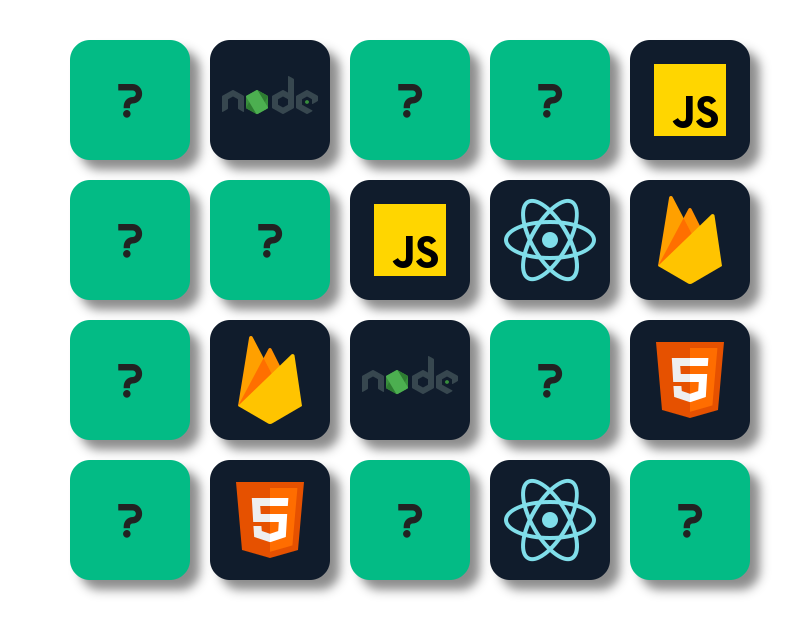
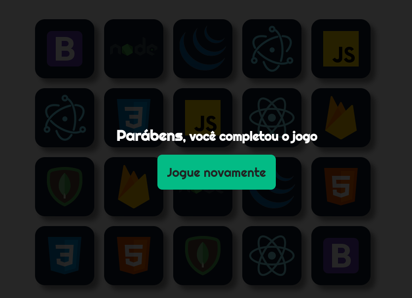

<div align="center">

  # Memory Game

  Test your memory ability with memory game

  <p>

   [About](#about-project) •
   [Technologies](#technologies) •
   [Getting started](#getting-started) •

  </p>

</div>

<h2 id="images">📷 Images</h2>
<div align="center">

  
  
  

</div>

<h2 id="about-project">ℹ About the project</h2>

A special game for web developers, because here you can play the famous memory game with some of the best technologies on the market.

<h2 id="technologies">🚀 Technologies</h2>

-  HTML
-  CSS
-  JavaScript

<h2 id="getting-started">⚙ Getting started</h2>

1. Install the [Git](https://git-scm.com/) on your machine.

2. Clone the repository:
```
git clone https://github.com/nicolasrafaelduma/JogoDaMemoria
